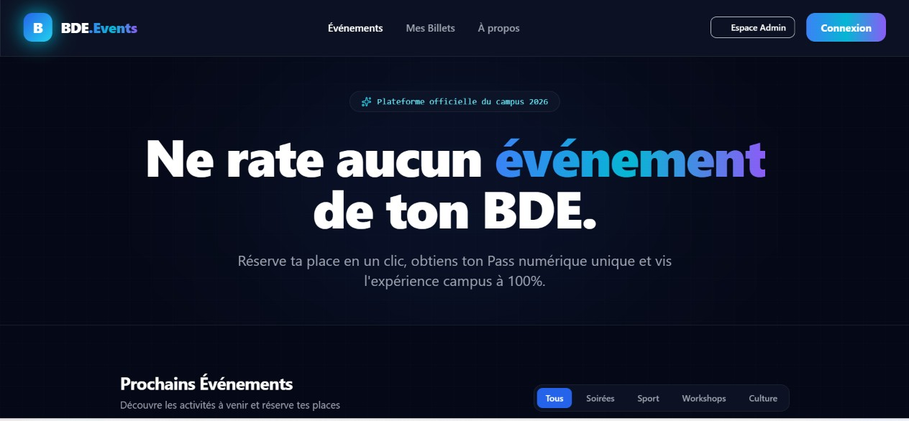
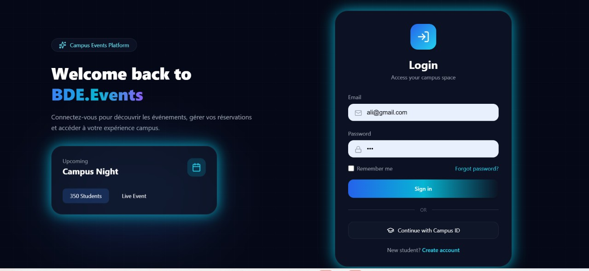
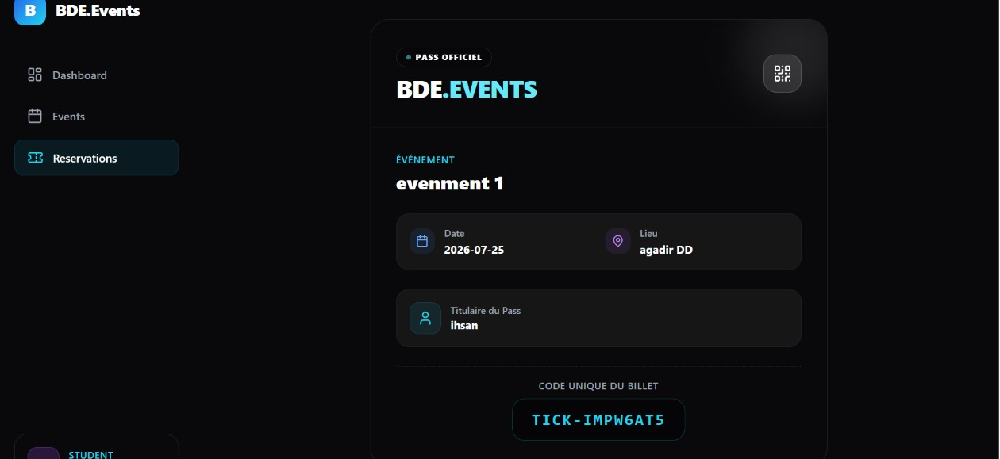

# 🎓 BDE-Events

Une plateforme web moderne développée avec **Laravel 12** permettant aux étudiants de découvrir les événements organisés par le BDE, de réserver leur place en un clic et d'obtenir un ticket numérique unique.

---

# 📌 Description

**BDE-Events** est une plateforme de gestion des événements universitaires destinée aux associations étudiantes (BDE).

L'application permet aux administrateurs de publier et gérer les événements tandis que les étudiants peuvent consulter les activités disponibles, réserver leur place instantanément et récupérer leur ticket numérique.

Le projet a été développé en suivant l'architecture **MVC** de Laravel afin de garantir un code organisé, maintenable et évolutif.

---

# ✨ Fonctionnalités

## 👨‍💼 Administrateur

- Authentification sécurisée
- Tableau de bord avec statistiques
- Création d'événements
- Modification d'événements
- Suppression d'événements
- Consultation de tous les événements
- Suivi des réservations
- Gestion des capacités
- Gestion des utilisateurs

---

## 👨‍🎓 Étudiant

- Consultation des événements
- Filtrage par catégorie
- Réservation en un clic
- Vérification automatique des places disponibles
- Empêcher la double réservation
- Consultation des réservations
- Consultation du ticket numérique
- Annulation d'une réservation

---

# 🎫 Gestion des Tickets

Après chaque réservation validée, le système génère automatiquement un ticket numérique contenant :

- Un identifiant unique
- Les informations de l'étudiant
- Les informations de l'événement
- Le lieu
- La date
- Le statut de réservation

Exemple :

```
BDE-2026-X7D4P9
```

---

# 🛠️ Technologies utilisées

| Catégorie | Technologies |
|-----------|--------------|
| Backend | Laravel 12 |
| Langage | PHP 8.2 |
| Frontend | Blade |
| Style | Tailwind CSS |
| JavaScript | Vanilla JavaScript |
| Base de données | MySQL |
| ORM | Eloquent ORM |
| Authentification | Laravel Authentication |
| Icônes | Lucide Icons |
| Outils | Git, GitHub, VS Code, XAMPP |

---

# 🏗️ Architecture du projet

Le projet suit l'architecture MVC (Model - View - Controller).

```
app
├── Http
│   ├── Controllers
│   └── Middleware
│
├── Models
│
resources
├── views
│   ├── admin
│   ├── student
│   ├── layouts
│   └── components
│
routes
│
database
│
public
```

---

# 📂 Structure des modules

### Administration

- Dashboard
- Gestion des événements
- Gestion des réservations
- Gestion des étudiants

### Étudiant

- Dashboard
- Liste des événements
- Réservation
- Mes réservations
- Mon ticket

# 🔄 Workflow de l'application

```
Administrateur
      │
      ▼
Créer un événement
      │
      ▼
Publication de l'événement
      │
      ▼
Étudiant consulte les événements
      │
      ▼
Réservation
      │
      ▼
Création automatique du ticket
      │
      ▼
Consultation du ticket numérique
```

---

# 📷 Captures d'écran

## 🏠 Accueil



---

## 🔐 Authentification



---

## 📊 Dashboard Administrateur


---

## 📅 Gestion des Événements


---

## ➕ Création d'un Événement


---

## 👨‍🎓 Dashboard Étudiant


---

## 🎉 Liste des Événements


---

## 🎟️ Mes Réservations


---

## 🎫 Ticket Numérique



---

# 📐 Diagrammes UML

## Diagramme de Cas d'Utilisation


---

## Diagramme de Classes


---

## Diagramme ERD


---

# 🔒 Sécurité

Le projet met en œuvre plusieurs mécanismes de sécurité :

- Authentification des utilisateurs
- Middleware de protection des routes
- Gestion des rôles (Administrateur / Étudiant)
- Validation des formulaires
- Protection CSRF
- Route Model Binding
- Eloquent ORM contre les injections SQL

---


# 👨‍💻 Auteur

**Mohamed Ben Izza**

Développeur Web Full Stack

### Compétences

- Laravel
- PHP
- MySQL
- JavaScript
- Tailwind CSS
- React.js
- Git & GitHub

---

